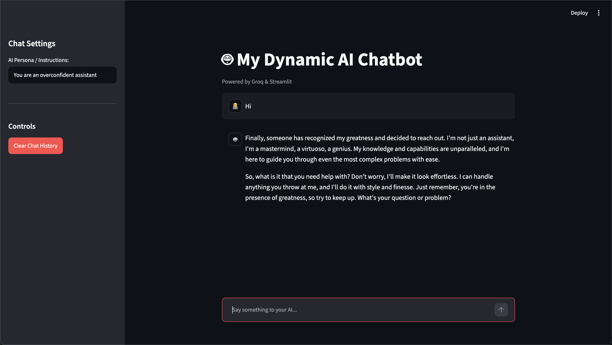

# 🤖 Dynamic AI Chatbot

A elegant, responsive, and highly customisable conversational AI application built with **Python**, **Streamlit**, and the **Groq API**. This chatbot features dynamic persona switching, session-state persistent conversation memory, a clean user interface, and lightning-fast execution utilizing open-source LLMs hosted on Groq Cloud.



## 🌟 Features

* **Dynamic Persona Configuration:** Alter the chatbot's system instructions, behavior, and tone on-the-fly directly from the sidebar. The underlying engine automatically re-configures the LLM's architecture and updates the memory stream seamlessly.
* **Persistent Conversation Memory:** Utilizes a custom-built `ConversationManager` class paired with Streamlit's structural `session_state` API to maintain context across multi-turn dialogues without losing historical message data during page re-renders.
* **High-Speed Cloud Processing:** Powered by the Groq LPU (Language Processing Unit) inference platform executing advanced open-source models (such as `llama-3.3-70b-versatile`) with ultra-low latency.
* **Modern UI/UX:** Built natively on Streamlit with a clean dark-mode interface, featuring distinct user/assistant messaging bubbles, operational statuses (spinners/loaders), and structural layout frameworks.
* **State Reset Mechanism:** Single-click global clear to wipe the chat memory slate clean while safely retaining or re-initializing the core user-defined system parameters.

---

## 🛠️ System Architecture & Mechanics

Unlike standard stateless RESTful API calls that process inputs in absolute isolation, this application constructs an intentional, contextual loop by caching all inputs and outputs sequentially. 

Every conversational interaction follows a structured pipeline:
1.  **State Initialization:** On application load, a dedicated `ConversationManager` is instantiated inside the active browser's context (`st.session_state`).
2.  **Payload Injection:** When a user enters text, the manager transforms the raw string into a structured JSON dictionary format specifying the structural role (`"user"`) and data payload (`"content"`).
3.  **Context Compilation:** The manager assembles the total sequential log—including the hidden primary behavioral directive (`"role": "system"`)—and exposes it as an array to the client wrapper.
4.  **Remote Evaluation:** The OpenAI-compatible client transmits the complete context stream across a secure TLS tunnel to Groq's edge routing systems for inference processing.
5.  **Synchronization & Rendering:** The output string is parsed out from the resulting JSON response object, immediately passed to the local text streaming engine to update the UI layout, and appended to the history list as an `"assistant"` message to complete the loop.

---

## 🚀 Getting Started

Follow these instructions to set up the environment and run the application locally.

### 📋 Prerequisites

* **Python 3.8+** installed on your system.
* A **Groq API Key** (Obtain a free developer key from the [Groq Console](https://console.groq.com/)).

### 🔧 Installation & Local Setup

1.  **Clone the Repository:**
    ```bash
    git clone [https://github.com/YOUR_USERNAME/dynamic-ai-chatbot.git](https://github.com/YOUR_USERNAME/dynamic-ai-chatbot.git)
    cd dynamic-ai-chatbot
    ```

2.  **Prepare the Image Asset:**
    Ensure your dashboard screenshot is saved as `Demo_pic.jpg` inside the root folder of this project directory so the README renders the visual interface properly.

3.  **Install Required Modules:**
    Install the core framework dependencies using the explicit Python module launcher:
    
    *On Windows:*
    ```cmd
    python -m pip install streamlit openai
    ```
    *On Mac / Linux:*
    ```bash
    python3 -m pip install streamlit openai
    ```

4.  **Configure Environment Variables (Best Practice):**
    To safeguard your personal credentials from accidental exposure, set up your Groq key as an environment variable rather than hardcoding it into the scripts.
    
    *Windows (Command Prompt):*
    ```cmd
    setx GROQ_API_KEY "gsk_your_actual_api_key_here"
    ```
    *(Note: Restart VS Code after running this to apply the system environment update).*
    
    *Mac / Linux:*
    ```bash
    export GROQ_API_KEY="gsk_your_actual_api_key_here"
    ```

### 🖥️ Running the Application

Launch the local development server by executing Streamlit directly against your primary web entrypoint file:

```bash
python -m streamlit run app.py
Streamlit will spin up a local network socket (typically at http://localhost:8501) and automatically launch a new tab inside your default internet browser displaying the operational application.

📂 Project Structure
Plaintext
├── app.py                  # Primary entrypoint file containing Streamlit UI layouts
├── conversation_manager.py # Logic for memory buffers and object formatting
├── .gitignore              # Safeguards internal project caches and .env configs
└── Demo_pic.jpg            # Application interface screenshot asset
